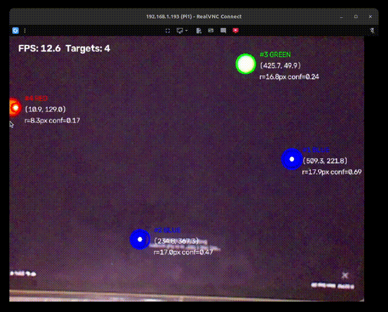
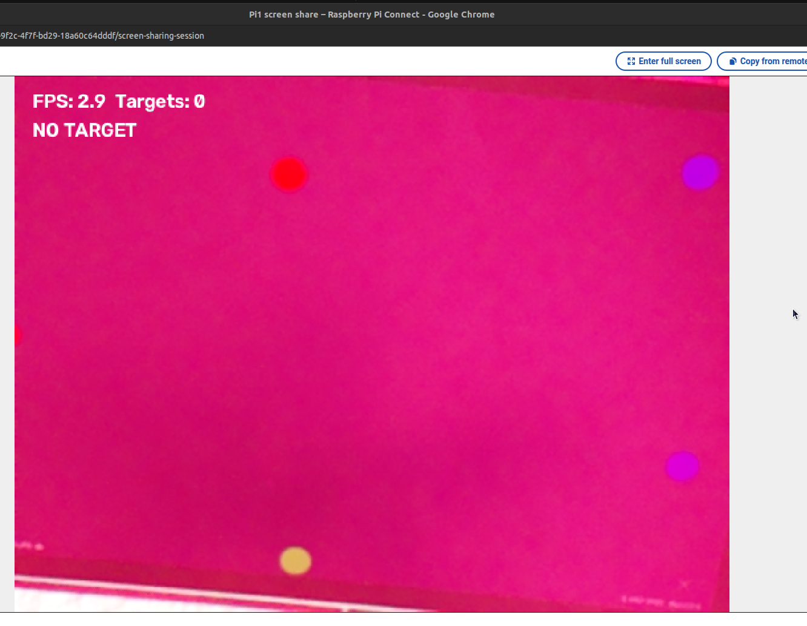
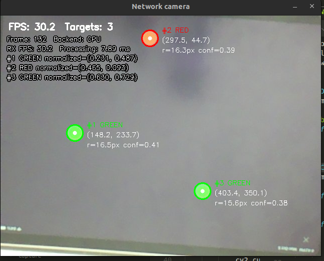

# Real-Time Embedded Optical Signal Detection

Detect red, green, and blue optical points with a Raspberry Pi camera and OpenCV.
No ML is used. Choose one of three launch methods:

| Method | Raspberry Pi | PC / GPU workstation |
| --- | --- | --- |
| [1. Pi only (CPU)](#method-1-launch-on-the-raspberry-pi-only) | Capture, detect, and display locally | Not needed |
| [2. Pi → PC (CPU)](#method-2-pi--pc-cpu) | Capture and send JPEG frames over TCP | Receive, detect, display, and profile |
| [3. Pi → PC (GPU)](#method-3-pi--pc-gpu) | Capture and send JPEG frames | GPU HSV/morphology, CPU contour filtering |

**Backend support:** Methods 1 and 2 use CPU OpenCV. [Method 3: Pi → PC CUDA](docs/cuda.md)
uses the new hybrid GPU backend. It requires CUDA-enabled OpenCV on an NVIDIA PC.
GPU accuracy and speed still require hardware validation; the development
environment has no usable CUDA device. See the guide for build, validation,
launch, and benchmark instructions.

For a repeatable three-method comparison, see [performance and accuracy experiments](docs/experiments.md): trial commands, CSV summaries, precision/recall, and position error.



See [Experimental results and discussion](#experimental-results-and-discussion)
for the detailed interpretation and proposed follow-up experiments.


Run every command below from the repository root on the indicated machine.
For test targets, open the [phone signal generator](#optical-signal-generator).

## Method 1: Launch on the Raspberry Pi only

```text
Phone RGB points → Pi camera → Picamera2 → OpenCV detector → Pi display
```

### Set up the Pi (first time)

Connect the camera and install Picamera2, then create an environment that can
access the Raspberry Pi system packages:

```bash
sudo apt install python3-picamera2
python3 -m venv --system-site-packages .venv
source .venv/bin/activate
pip install -r requirements.txt
```

If this environment is already set up, just run `source .venv/bin/activate`.

### Launch the recommended local configuration

The IMX219 NoIR camera produced a much less pink image with its matching ISP
tuning. Close `rpicam-hello` before launching so it releases the camera:

```bash
python -m src.pipeline --display \
  --tuning-file /usr/share/libcamera/ipa/rpi/vc4/imx219_noir.json \
  --config configs/detection-noir.yaml \
  --debug-dir captures/noir-debug
```

- `--tuning-file`: correct camera processing before both detection and display.
  This path is for Pi 4 and earlier; on Pi 5 use `pisp` instead of `vc4`.
  Use the file matching your camera model.
- `--config`: detector thresholds for the corrected image.
- `--debug-dir`: show color masks and rejection diagnostics; save the last frame,
  masks, and `report.json` in `captures/noir-debug` when the run ends.

The tuning must be supplied each launch; running `rpicam-hello` beforehand does
not configure this process. No chart calibration or `--correct-preview` is needed.
Avoid old calibrated samples or `detection-red-background.yaml` with this command:
those settings were fitted to the pink image. The old profile remains available
for captures made without the camera tuning.

Default capture is 640×480 at a requested 30 FPS; debug processing reduces actual
throughput. Press **q/Escape** or **Ctrl+C** to exit. For headless operation, omit
`--display`. Debug files overwrite previous captures in the same directory.

For missed red points, see [Adjust red detection](#adjust-red-detection).

### Why the NoIR tuning file is needed

`--tuning-file /usr/share/libcamera/ipa/rpi/vc4/imx219_noir.json` loads the
image signal processor (ISP) settings intended for the IMX219 NoIR module.
NoIR cameras lack an infrared-cut filter and need different automatic white
balance settings from standard camera modules. The default tuning produced a
strong pink cast in this setup, shifting the apparent colors of both targets
and background. The matching NoIR tuning greatly reduced that cast, making
ordinary HSV color thresholds more useful. Raspberry Pi documents the need
for this [NoIR tuning override](https://www.raspberrypi.com/documentation/computers/camera_software.html#tweak-camera-behaviour-with-tuning-files).

This correction happens on the Pi before detection or JPEG transmission, so
both the Pi-only and PC receiver methods benefit. It is camera tuning rather
than the optional interactive color-chart calibration. Supply the option on
every launch; `--config` separately controls the detector's color and blob
thresholds. Use `pisp` instead of `vc4` on Pi 5.

<table>
  <tr>
    <th width="50%">Before color correction</th>
    <th width="50%">After NoIR tuning</th>
  </tr>
  <tr>
    <td></td>
    <td></td>
  </tr>
</table>

These screenshots illustrate the improvement in color appearance. They show
different scenes and processing setups, so their displayed FPS values are not
a controlled before/after performance comparison.

## Method 2: Pi → PC (CPU)

```text
Phone RGB points → Pi camera → Picamera2 → JPEG encoding
  → TCP → PC JPEG decoding → CPU detector → PC display + CSV profiling
```

The Pi performs camera capture and JPEG encoding. Detection and visualization
run on the PC CPU; no GPU is required or used. Use this mode to move processing
off the Pi and collect timing
measurements. Start the PC receiver **before** the Pi sender.

### Set up both machines (first time)

Have the same repository version on both machines. Set up the Pi using the steps
in Method 1. On the Linux PC, Picamera2 is not required:

```bash
python3 -m venv .venv
source .venv/bin/activate
pip install -r requirements.txt
```

Ensure `configs/detection-noir.yaml` on the PC contains the settings
that worked on the Pi; this mode loads the detector configuration on the PC.

### Step 1 — Find the PC's LAN address

On the **PC**, run:

```bash
hostname -I
```

Choose the address reachable from the Pi, for example `192.168.1.100`. Both machines
must be able to reach each other over the network. Allow inbound **TCP port 5000**
on the PC firewall from the Pi. The detailed [network guide](docs/network.md)
includes firewall and connectivity troubleshooting.

### Step 2 — Start the receiver on the PC

In the repository root on the **PC**:

```bash
source .venv/bin/activate
python -m src.network.receiver --bind 0.0.0.0 --port 5000 \
  --backend cpu --display \
  --config configs/detection-noir.yaml \
  --csv results/network/cpu.csv
```

Wait for `Listening on 0.0.0.0:5000`. The preview will appear on the PC when
frames arrive. Omit `--display` if the PC has no graphical session.

### Step 3 — Start the sender on the Pi

Stop the Pi-only pipeline first so it releases the camera. Then, in the repository
root on the **Pi**, run the following, replacing the example address with your PC's
LAN address:

```bash
source .venv/bin/activate
python -m src.network.sender --host 192.168.1.210 --port 5000 \
  --width 640 --height 480 --fps 30 --jpeg-quality 85 \
  --tuning-file /usr/share/libcamera/ipa/rpi/vc4/imx219_noir.json
```

Do not use `localhost` or `0.0.0.0` as the sender's destination for a remote PC.
The Pi sender applies camera tuning before encoding; the PC loads the detector
thresholds. Use `pisp` instead of `vc4` on Pi 5. The Pi sender does not run the detector. Use **q/Escape** in the PC preview or
**Ctrl+C** to stop; the sender also exits and releases the camera on disconnect.

### CPU results and profiling

The PC writes measured per-frame timings and detections to
`results/network/cpu.csv`, plus aggregate statistics to
`results/network/cpu.summary.json`. These files are overwritten on a new run with
the same path. A one-slot latest-frame buffer replaces old pending frames if
processing falls behind, and counts those replacements. Pi and PC timestamps
have different clock origins; they are not subtracted to claim network latency.

See [network setup, validation, and profiling](docs/network.md) for static-image
and video sender tests, protocol details, timing definitions, and troubleshooting.

## Method 3: Pi → PC (GPU)

```text
Phone RGB points → Pi camera with NoIR tuning → JPEG encoding → TCP
  → PC CPU JPEG decoding → GPU HSV masks and morphology
  → PC CPU contour filtering → PC display + CSV profiling
```

This method uses `--backend cuda` on an NVIDIA PC. It accelerates HSV conversion,
color thresholding and morphology; JPEG decoding, contour measurement and
visualization still run on the CPU. The Pi sender is the same as Method 2.

### Set up and validate CUDA on the PC

Follow the **[CUDA build, validation and benchmark guide](docs/cuda.md)** first.
It explains how to create `.venv-cuda` and install CUDA-enabled OpenCV. Standard
pip OpenCV wheels do not enable CUDA acceleration.

In the repository root on the **PC**, validate the CUDA environment:

```bash
source .venv-cuda/bin/activate
python tools/check_cuda.py
python -m pytest tests/test_cuda_backend.py -v
```

Continue only if preflight and GPU tests pass without skips. The preflight report
is saved to `results/benchmark/cuda-preflight.json`.

### Start the GPU receiver on the PC

```bash
python -m src.network.receiver --bind 0.0.0.0 --port 5000 \
  --backend cuda --display \
  --config configs/detection-noir.yaml \
  --csv results/network/cuda.csv
```

Wait for `Listening on 0.0.0.0:5000` before starting the Pi sender.

### Start the sender on the Pi

Close any other camera process and replace `YOUR_PC_IP` with the PC's LAN address:

```bash
source .venv/bin/activate
python -m src.network.sender --host YOUR_PC_IP --port 5000 \
  --width 640 --height 480 --fps 30 --jpeg-quality 85 \
  --tuning-file /usr/share/libcamera/ipa/rpi/vc4/imx219_noir.json
```

Use `pisp` instead of `vc4` on Pi 5. Camera tuning runs on the Pi; detector
thresholds are loaded on the PC. This backend supports HSV configurations such
as `detection-noir.yaml`, not calibrated `color_samples_bgr` configurations.

### GPU results and profiling

The receiver reports `backend=cuda` and writes `results/network/cuda.csv` and
`results/network/cuda.summary.json`. Use **q/Escape** in the PC preview or
**Ctrl+C** to stop. Compare GPU and CPU measurements using the
[experiment guide](docs/experiments.md); GPU acceleration does not guarantee
lower latency for this workload.

## Experimental results and discussion

The following results were reported from three trials per method at **640×480**
with the camera/sender configured for **30 FPS**. Detector time includes GPU
upload and download where applicable; it excludes camera acquisition, network
transport, JPEG decoding and visualization. See the [experiment guide](docs/experiments.md)
for timing definitions and a repeatable comparison procedure.

| Method | Trials | Mean FPS | Mean detector ms incl. transfers |
| --- | ---: | ---: | ---: |
| Pi only | 3 | 12.11 | 77.529 |
| Pi → PC CPU | 3 | 29.43 | 9.091 |
| Pi → PC CUDA | 3 | 29.50 | 12.428 |

**The PC CPU had the lowest detector time in this experiment.** CUDA took
3.337 ms more per frame, or about 36.7% longer, including transfers. Method3's slightly
higher FPS does not establish a GPU speed advantage.
That difference is only 0.07 FPS (about 0.24%); trial variability is needed to
judge whether it is meaningful. Moving processing from the Pi to either PC
backend increased observed throughput by roughly 2.4 times.

### Why CPU and CUDA both deliver about 30 FPS

At the configured 30 FPS, a new source frame is available about every
`1000 / 30 = 33.3 ms`. The PC detector times, 9.091 ms and 12.428 ms, are both
well below that interval. Once each PC finishes its work, it can wait for the
next frame rather than immediately process another one. The measured rates
near 30 FPS are therefore consistent with an input-rate limit, even though
CPU detection is faster. JPEG decoding, transmission and display also consume
time, so detector time alone cannot prove how much idle time remains.

By contrast, the Pi's 77.529 ms detector time already exceeds the 33.3 ms frame
budget. Detection alone corresponds to roughly 12.9 frames per second; capture
and other loop overhead help explain the observed 12.11 FPS. The Pi-only method
is processing-limited under these conditions. The 30 FPS setting is the input
rate of this experiment, not a claim that every IMX219 sensor mode is limited
to 30 FPS.

### Why the GPU is not faster here

At 640×480, each frame contains only 307,200 pixels, and HSV thresholding and
morphology are relatively lightweight operations. A PC CPU can handle this
work efficiently. The CUDA path additionally uploads the image, launches GPU
operations and downloads the HSV image and masks. It also retains contour
measurement, local contrast checks and other filtering on the CPU. These costs
can outweigh the savings from parallel image processing at this workload.
This is an explanation consistent with the result; the separate upload,
processing and download measurements are needed to confirm the dominant cost.

Higher resolution or more intensive image processing **may** make the GPU
beneficial by providing more parallel work per transfer. That crossover is
not guaranteed: transfers and CPU stages can also become more expensive.
Increasing the number of target points is different from increasing resolution.
More points mainly increase contour and validation work, which currently runs
on the CPU, so more targets alone may not favor this CUDA implementation.

### What to conclude and test next

For this tested 640×480, 30 FPS workload, PC CPU processing is sufficient to
keep up with the stream and has the lowest measured detector time. CUDA is a
candidate for larger workloads, rather than a demonstrated improvement here.
Compare 640×480 and 1280×720 using identical source frames and configurations,
then vary target count separately. An offline benchmark without camera pacing
can reveal compute speed differences hidden by the 30 FPS input ceiling.
Report p95/p99 latency, skipped frames, GPU transfer time and variation across
trials alongside average FPS. These measurements are not camera-to-display
latency; that requires a separate end-to-end measurement.

Finally, I will work on report precision (false points), recall (missed points), per-color F1 and centroid
error on held-out labeled frames, including JPEG-compressed inputs. 
The table
above contains performance results only and does not establish equal accuracy
between methods, but it's not enought. Throughput is useful only if detection remains correct. 

## Additional local inputs and output

Run commands from the project root with the virtual environment activated.
For image/video/webcam experiments, pass the same configuration used by your
working Pi-only command:

```bash
python -m src.pipeline --config configs/detection-red-background.yaml --jsonl detections.jsonl
python -m src.pipeline --demo --display
python -m src.pipeline --demo --max-frames 90 --jsonl demo.jsonl --output demo.png
python -m src.pipeline --image test.jpg --config configs/detection-red-background.yaml --output annotated.jpg
python -m src.pipeline --video recording.mp4 --config configs/detection-red-background.yaml --display
python -m src.pipeline --webcam 0 --config configs/detection-red-background.yaml --display
```

`--output` saves the final annotated image; `--jsonl` writes one record per frame
with `count` and a `detections` array containing all valid blobs. The original
top-level detection fields still describe the largest blob for compatibility. These paths overwrite existing files. `--max-frames N` bounds a run;
video files stop at EOF. Console status is printed once per second, or once for a
still image:

```text
Targets: 2 | FPS: 29.4
#1 Color: RED | Position: (318, 221) | Radius: 14.0 px | Confidence: 0.89
#2 Color: BLUE | Position: (120, 180) | Radius: 10.0 px | Confidence: 0.86
```

Values above illustrate the format. FPS is measured pipeline throughput, starts at
zero until the first one-second measurement, and is not a hardware performance
guarantee. Video files are processed as fast as possible. Demo mode is paced by
`--fps` and cycles through moving red, green, and blue targets.

The preview labels every valid blob with its color, position, equivalent-area
radius, and confidence, plus frame FPS and target count. Labels are numbered by
area within each frame; these numbers are not persistent tracking IDs.
Missing targets show `NO TARGET`; JSONL has `count: 0`, `detections: []`, and
`valid: false` in the compatibility fields.

Use `Detector.detect_all(frame)` to obtain the list of targets, ordered by
descending area. The original `Detector.detect(frame)` API still returns only
the largest valid blob. Temporal association and spectral/wavelength estimation
are outside this MVP.

### Threshold tuning

Edit the YAML file passed with `--config` (otherwise `configs/detection.yaml`):

- `colors.*.hue_ranges`: OpenCV hue ranges (0–179); red wraps around the hue boundary.
- `saturation_min`: reject white/gray pixels.
- `value_min`: HSV brightness threshold (0–255); increase to reject dim backgrounds.
- `min_area` / `max_area`: valid contour area in pixels squared. Adjust for target
  distance and input resolution; image/video inputs retain their original size.
- `min_confidence`: minimum blob quality score (default 0, range 0–1). Set to
  0 to disable. Increase to reject weak/irregular background patches; decrease
  if real targets are dim, desaturated, or distorted by perspective.
- `morphology.open_kernel` / `close_kernel`: positive kernel sizes to remove specks
  and close small gaps (defaults 3 and 5).

All contours that pass the area and confidence filters are returned, including multiple blobs
of the same color. Overlapping color masks use red, then green, then blue
priority so the same pixels cannot produce duplicate detections. Touching blobs
of the same color can merge into one contour; keep targets separated.
Radius is `sqrt(area / pi)`. Confidence is a heuristic in [0, 1]:
`circularity × mean saturation / 255 × mean brightness / 255`, measured only on
each blob. It is not a calibrated detection probability. Blobs below
`min_confidence` are rejected and reported as `low_confidence` in debug output.
Bright, round colored background objects can still be detected;
start with a dark background and tune thresholds using the phone target.

Picamera2's `RGB888` arrays already contain BGR bytes, so capture passes them
straight to OpenCV; see the [official Picamera2 manual](https://datasheets.raspberrypi.com/camera/picamera2-manual.pdf).
External RGB arrays must be converted with `cv2.COLOR_RGB2BGR` before calling
`Detector.detect()`.

### Debug a missing red target

Keep a red target stationary on a black background, then run:

```bash
python -m src.pipeline --display --debug-dir captures/red-debug
```

The extra windows show the red HSV mask and the mask after morphology. Click the
red target in the main preview to print its original BGR/HSV pixel values and
which red thresholds it fails. Console diagnostics report matched pixel counts
and accepted, too-small, and too-large contours. On exit (`q` or Ctrl+C), the
last unannotated frame, all color masks, and `report.json` are saved in the chosen
directory, overwriting previous debug captures there. Debugging adds processing
overhead. Press **S** in the main preview to save the current raw frame, masks,
and report in a timestamped subdirectory of `--debug-dir`. Use this while a dot
is missed so the saved evidence matches the failing scene; normal exit saves
only the final scene. Headless capture is also supported:

```bash
python -m src.pipeline --max-frames 90 --debug-dir captures/red-debug
```

Interpret the red diagnostics before changing `configs/detection.yaml`:

- No red pixels at the target: inspect clicked hue, saturation, and brightness.
  Defaults accept hue 0–12 or 168–179, saturation >= 80, and brightness >= 60.
- Present in the threshold mask but gone after morphology: the target is too
  thin/small for the opening kernel. Enlarge the displayed target or tune the kernel.
- `too_small`: contour area is below 50 camera pixels squared.
- `too_large`: contour area exceeds 5000 camera pixels squared. Inspect the mask
  for merged background regions before increasing this limit.

A red-looking preview alone does not establish which filter failed. The saved
raw frame can be replayed with `--image captures/red-debug/frame.png` while tuning.

### Camera-specific color calibration (pink background, shifted green/blue)

A uniform confidence cutoff can remove dim blue targets while keeping bright
background fragments. Confidence is diagnostic-only by default again. For a
camera whose green targets look yellow or blue targets look purple, use camera
samples instead of broadening HSV ranges:

1. Pause the generator on a scene containing at least one known red, green, and
   blue dot. Keep the camera, phone, and lighting fixed; hide generator controls.
2. Start the calibration preview:

   ```bash
   python -m src.pipeline --calibrate-colors configs/camera-colors.yaml
   ```

3. Let exposure settle, focus the preview window, then press **C** to freeze it.
   Click the **actual red**, **actual green**, and **actual blue** dot centers in
   that order. Label by the generator's source color, even if the camera makes it
   look yellow or purple. Then click three representative background patches
   (no dots), including the phone background and surrounding clutter.
4. Press **S** to save the YAML and exit. **U** undoes the last click;
   **Q/Escape** cancels calibration. If sampled classes are too similar, resample
   or improve lighting. Saving overwrites the specified YAML file.
5. Run the detector with the saved configuration:

   ```bash
   python -m src.pipeline --display --config configs/camera-colors.yaml --debug-dir captures/calibrated
   ```

Calibration uses deterministic distances to labeled color samples in OpenCV Lab
with reduced luminance weight; no ML model is trained. A pixel must be within
`color_distance_max` (30) of a target sample and closer to that class than any
other target/background class by `color_margin` (8). Calibrated matching replaces
HSV thresholds for all three colors. Unmatched and ambiguous pixels are excluded.

The saved profile also enables independent `min_circularity: 0.55` and
`min_color_contrast: 12` filters, comparing each blob with a nearby surrounding
ring. Contrast uses the same weighted Lab units, not a calibrated Delta E metric.
`min_confidence: 0` avoids penalizing a dim but distinct blue target merely for
being dim. All are starting parameters and may need adjustment for perspective,
target size, or lighting. Debug windows/reports now cover **all three colors**
and report `low_circularity` and `low_contrast` rejections.

Recalibrate after changing illumination, camera white balance, or screen settings.
Calibration cannot recover colors that the camera renders indistinguishably or
exclude background objects identical in color and shape to targets. Synthetic
color-shift/noise tests pass; live camera calibration is required before judging
accuracy. `--image` also supports calibration from a saved raw camera frame.

### NoIR camera: correct the pink cast at capture

If the IMX219 NoIR tuning improves `rpicam-hello`, close that preview and use
the same tuning in the detector. This requires no chart calibration:

```bash
python -m src.pipeline --display \
  --tuning-file /usr/share/libcamera/ipa/rpi/vc4/imx219_noir.json \
  --config configs/detection-noir.yaml --debug-dir captures/noir-debug
```

Use `pisp` instead of `vc4` on Pi 5. Select the tuning matching your camera.
The camera loads the tuning before capture; detection, preview, debug images,
and network frames all receive the resulting BGR pixels. It is not a preview-only
correction. A missing or invalid file fails rather than silently using default tuning.
The previous `rpicam-hello` command does not persist settings for this process.

For Pi-to-PC processing, add the same `--tuning-file` option to
`python -m src.network.sender --host PC_IP` on the Pi, and use
`--config configs/detection-noir.yaml` on the PC receiver.
The NoIR detector profile uses ordinary HSV ranges plus shape/local-contrast
filtering. Its thresholds are a starting point requiring live validation;
the red-background profile and old color samples were fitted to different pixels.

### Adjust red detection

Yes: edit `colors.red` in `configs/detection-noir.yaml`, then restart the
pipeline. The YAML is loaded at startup, not watched for changes. For network
processing, edit the receiver's config on the PC and restart the receiver.

First run with `--display --debug-dir captures/noir-debug` and click inside a
missed red dot in **Spectrum Tracker**. The terminal prints its BGR/HSV values
and which red threshold failed. Sample several pixels inside the colored part;
a white highlight or an edge may not represent the dot. Press **S** while the
preview is focused to save a snapshot and its rejection report.

The current red settings are:

```yaml
colors:
  red:
    hue_ranges:
      - [0, 12]
      - [168, 180]
    saturation_min: 80
    saturation_max: 255
    value_min: 60
    value_max: 255
```

OpenCV's 8-bit HSV hue values are 0–179; the upper bound 180 includes the end
of that range. Red wraps around zero, so keep both hue intervals.
Saturation and brightness use 0–255. All three checks must pass.

| Diagnostic | Adjustment to try | Tradeoff |
| --- | --- | --- |
| Brightness below 60 | Lower red `value_min` to 45, then 35 only if needed | Admits darker background pixels |
| Saturation below 80 | Lower red `saturation_min` to 60 | Admits more dull or nearly neutral pixels |
| Hue just outside the ranges | Try `[0, 18]` and `[165, 180]` | Admits more orange and magenta |
| `too_small` in the report | Lower global `min_area` from 50 to 30 | Admits smaller noise blobs |
| Dot exists in threshold mask but disappears after morphology | Try global `open_kernel: 1` instead of 3 | Keeps more isolated noise |
| `low_contrast` | Try global `min_color_contrast: 8.0` instead of 12.0 | Admits targets less distinct from their surroundings |
| `low_circularity` | Check focus and viewing angle before lowering global `min_circularity` | Looser limits admit more irregular background shapes |

Change only the setting supported by the diagnostic, then compare misses and
false detections under the same lighting. Red HSV edits affect red only;
area, morphology, circularity, and contrast settings affect all three colors.
A white dot in the red threshold mask already passed HSV: lowering brightness
will not fix a subsequent contour rejection. Avoid widening every limit at once.

### Automatic sampling from a reference chart

Use this when manual single-pixel calibration is inconsistent. The program needs
known source colors: arbitrary first frames cannot establish whether an observed
purple object was originally blue, red, or background. This workflow automates
sampling over multiple frames using the entire camera view, with no corner clicks or confirmation keys.
It is guided calibration, not unsupervised recognition of an unknown scene.

1. Start the existing phone web server, open the signal generator, and choose
   **Open automatic calibration chart**. The chart inherits the generator's
   brightness setting. Fill the camera view with the chart, upright and facing the
   camera: red/green/blue across the top, black/gray/white across the bottom.
   Keep the phone's physical brightness unchanged. Hide instructions on the chart.
2. Run on the Pi:

   ```bash
   python -m src.pipeline --auto-calibrate-colors configs/camera-auto.yaml
   ```

3. Capture starts automatically: 30 settling frames followed by 20 sample frames,
   then the YAML is saved. Keep the camera and phone still. Preview boxes show
   the fixed sampling areas; each must sit inside its matching chart patch.
   **Q/Escape** cancels without saving. Use `--calibration-frames 30` for more samples.
4. Return the phone to the signal generator and run:

   ```bash
   python -m src.pipeline --display --config configs/camera-auto.yaml --debug-dir captures/auto-calibrated
   ```

The program uses the whole frame as a 3-by-2 chart and samples the centers of its
red/green/blue/black/gray/white patches across frames, and uses stable RGB/black
samples for the existing calibrated detector. Distinct color classes and temporal
stability are checked before replacing the output YAML. Several samples per color
are retained to cover modest variation; this is not continuous online adaptation.
Your existing `configs/camera-colors.yaml` is untouched by the commands above.

An optional black-offset plus color-matrix correction is fitted from the chart.
If independent gray/white checks pass, the file contains `preview_color_matrix`.
To display that approximate corrected image:

```bash
python -m src.pipeline --display --config configs/camera-auto.yaml --correct-preview
```

`--correct-preview` affects only the displayed/annotated image. Detection and debug
pixel measurements still use the original BGR frame and its calibrated samples,
so changing the preview cannot silently change classification. If the correction
is unstable or neutral checks fail, calibration still saves color samples but
omits the preview matrix and prints a message; run without `--correct-preview`.
This is reference-based visual normalization, not recovery of physically accurate
colors under unknown infrared illumination.

Keep illumination, screen brightness, camera position, and camera color response
stable between calibration and detection. Camera auto exposure/white balance are
not locked by this workflow and may change when the chart is removed; if the
appearance changes significantly, the saved samples may no longer apply. Recheck
raw debug frames instead of assuming that a neutral-looking preview guarantees
correct detection. The automated capture workflow and color fit are tested with
synthetic inputs; this chart procedure still needs validation on your live setup.

### Red background contamination

This is the preferred profile for the current Pi/IMX219 setup, based on local testing.

If most of the phone is white in the red debug mask, red targets are connected
to the background instead of forming separate contours. Try the stricter profile:

```bash
python -m src.pipeline --display --config configs/detection-red-background.yaml --debug-dir captures/red-debug
```

This profile raises red `value_min` from 60 to 180 and `saturation_min` from 80
to 230. It also allows upper red hues from 166–179 and green hues from 24–89,
covering the yellow-shifted green dots in the saved camera regression frames.
Blue spans 90–150 to include the purple-shifted blue dots measured at hues 138–146.
`min_circularity: 0.55` and `min_color_contrast: 12` reject thin phone edges and
weak background fragments. Confidence remains diagnostic-only (`0`) so pale or
dim targets are not rejected just because of brightness/saturation.

The raw regression image is `tests/fixtures/red_cast_phone.png`; the updated
profile detects its three red and two green dots without bezel false positives.
A second regression image, `tests/fixtures/red_cast_phone_blue.png`, contains
two blue dots and one green dot; all three are detected without extra detections. This
profile filters the image; it does not remove the camera's pink tint. Restart the
pipeline after editing the YAML. Thresholds still depend on lighting. Keep the phone
background black and targets bright. The desired red mask has isolated white
spots against a black phone background. Click both a target and its nearby
background in the main preview to compare HSV values. Set `value_min` above the
background V and below the target V; restart after editing the YAML. If their
values overlap, global brightness thresholding cannot reliably separate them.
Stricter thresholds may reject dim or desaturated targets. Do not increase
`max_area` to accept the entire merged phone region.

### Validation

```bash
pip install -r requirements-dev.txt
python -m pytest -q
```

Tests cover the three colors, red hue wraparound, largest valid blob selection,
brightness rejection, selected-blob confidence, image/video execution, camera
channel order, and status rendering with no target. Camera hardware and GUI
preview require validation on the Raspberry Pi.

The original acquisition-only command remains available:

```bash
python -m src.capture.camera --display
```

## Optical Signal Generator

A browser-based optical signal generator is provided in:

```text
tools/signal_generator/index.html
```

It can display a configurable colored target that can be observed by the Raspberry Pi camera.

### Random multi-target scenes

Select **Random scenes**, enter the inclusive target count range **n–m** (0–200)
and the dwell time in seconds (0.1–3600), then press **Apply and advance** to apply.
Press **Start auto-advance** to cycle scenes and the same button to pause. **Next scene / Randomize**
advances immediately and restarts the dwell timer. Defaults are 1–5 targets and
3 seconds per scene; automatic switching starts only when requested.

Each scene randomly places non-overlapping circles, using mixed red/green/blue
colors or the selected fixed color. Brightness, radius, and background remain
controlled by their sliders/settings. Set n = m for a fixed count, or n = m = 0
for a blank scene. If the maximum count cannot fit, reduce m or the radius.
Resizing creates a new arrangement; returning from a background tab restarts the
full dwell time. Browser timers are approximate, not precision timing hardware.

Use **Experiment Mode** to hide the controls so they do not cover the targets;
click the screen or press Escape to return. **Manual target** retains the original
single-target position controls. Ground truth lists each target's color and
center in browser CSS pixels. The camera pipeline reports all valid blobs displayed by the page, subject to
the configured color, brightness, and area thresholds.

### Start the web server

From the project root:

```bash
cd tools/signal_generator
python3 -m http.server 8000 --bind 0.0.0.0
```

The HTTP server will serve `index.html` on port `8000`.

### Find the Raspberry Pi IP address

On the Raspberry Pi, run:

```bash
hostname -I
```

For example:

```text
192.168.1.193
```

### Open the signal generator on a phone

Make sure the phone and Raspberry Pi are connected to the same local network/Wi-Fi.

Then open a browser on the phone and navigate to:

```text
http://<RASPBERRY_PI_IP>:8000
```

For example:

```text
http://192.168.1.193:8000
```

Do not use `localhost:8000` on the phone. `localhost` would refer to the phone itself rather than the Raspberry Pi.

The resulting setup is:

```text
Phone
  │
  │ Wi-Fi / HTTP
  ▼
Raspberry Pi
  │
  ├── HTTP server :8000
  │     └── tools/signal_generator/index.html
  │
  └── Camera acquisition
        └── src/capture/camera.py
```

The phone can then be positioned in front of the Raspberry Pi camera and used as the optical signal source.

### Stop the web server

Press:

```text
Ctrl+C
```

in the terminal running the HTTP server.

## Notes on design

- The acquisition logic is encapsulated in `CameraAcquisition` so later stages can swap in a network sender or queue without changing the camera contract.
- The camera is configured for RGB888 because that matches the expected image format for simple OpenCV pipelines and avoids unnecessary conversion steps.
- FPS is computed using `time.perf_counter()` instead of wall-clock assumptions, which gives a more accurate measurement of the actual capture rate.
- Cleanup is intentionally explicit so the camera and OpenCV windows are released even when the user interrupts the program with `Ctrl+C`.
- The optical signal generator is kept separate from the acquisition pipeline so the phone can act as an independent ground-truth signal source.

## Future milestones

Future milestones will introduce:

- automatic ground-truth collection
- communication between the signal generator and detection pipeline
- experiment logging and evaluation
- CPU/CUDA benchmarking on the workstation
- optional GPU/CUDA acceleration

## Project goal

The project currently focuses on these stages:

- capture frames from the Raspberry Pi camera
- detect multiple red, green, and blue circular targets in real time
- calculate centroid, normalized position, area, radius, and brightness
- render a small deterministic overlay for debugging and validation
- keep detection and visualization separate for future experimentation

The first milestone focused on acquisition:

- initialize the Raspberry Pi camera with Picamera2
- capture frames at 640x480 resolution
- target 30 FPS
- convert frames into OpenCV-compatible BGR format
- print measured FPS once per second
- optionally display the live stream with `--display`
- release resources cleanly on `Ctrl+C`

## Folder structure

```text
embedded-optical-signal-detection/
├── README.md
├── requirements.txt
├── configs/
│   └── detection.yaml
├── src/
│   ├── pipeline.py
│   ├── capture/
│   │   ├── __init__.py
│   │   └── camera.py
│   ├── network/           # TCP sender, receiver, protocol, and JPEG codec
│   ├── profiling/         # Timing statistics and CSV logs
│   ├── detection/
│   │   ├── __init__.py
│   │   ├── detector.py
│   │   └── types.py
│   └── visualization/
│       ├── __init__.py
│       └── overlay.py
├── tests/
│   └── test_detector.py
└── tools/
    └── signal_generator/
        └── index.html
```

## Network protocol and architecture

Including implementing TCP framing, static-image/video and live Pi camera sending,
CPU detection on the receiver, a bounded latest-frame slot, overlays, and measured
CSV/JSON profiling. See [network setup and validation](docs/network.md) for
commands, clock limitations, and troubleshooting. The new [CUDA backend and
benchmark guide](docs/cuda.md) describes the hardware validation gates. The existing local detector and capture pipeline are
unchanged. The architecture is:

```text
Phone optical signal → Raspberry Pi Camera → Picamera2 (BGR)
  → JPEG encoder → framed TCP stream → Linux workstation
  → JPEG decoder → OpenCV CPU or hybrid CUDA backend
  → existing optical point detector → visualization + local profiling
```

Integration points already available:

- `CameraAcquisition.read()` returns a BGR frame, with `stop()` for cleanup.
- `Detector.detect_all(frame)` returns all valid spots; `detect(frame)` retains
  the largest-spot compatibility interface.
- `draw_detections(frame, results, fps)` renders the existing results.

### Protocol v1

Defined in `src/network/protocol.py`, using Python standard-library `struct`.
Every packet is **40 header bytes followed by exactly `jpeg_size` payload bytes**.
The struct format is `!4sBBHQQQHHI`: big-endian/network order, unsigned integer
fields, no implicit padding. There is no pickle or delimiter-based framing.

| Offset | Bytes | Field | Meaning |
| --- | --- | --- | --- |
| 0 | 4 | magic | ASCII `OSIG` |
| 4 | 1 | version | `1` |
| 5 | 1 | flags | `0`; other values rejected |
| 6 | 2 | header_size | `40`; other values rejected |
| 8 | 8 | frame_id | Increasing uint64 within one TCP connection |
| 16 | 8 | capture_timestamp_ns | Pi-local `time.monotonic_ns()` immediately after frame acquisition |
| 24 | 8 | jpeg_encode_ns | Pi-local JPEG encode duration, in nanoseconds |
| 32 | 2 | width | Source frame width in pixels |
| 34 | 2 | height | Source frame height in pixels |
| 36 | 4 | jpeg_size | Encoded JPEG payload length in bytes |
| 40 | jpeg_size | JPEG payload | Encoded image bytes |

Limits: payload size **1–8 MiB**, each dimension **1–8192**, and at most
**16,777,216 pixels**. Headers are validated before any payload allocation/read.
The receiver also checks JPEG decode success and matches the actual decoded
dimensions against the header; transport framing alone cannot verify JPEG content. Capture timestamp denotes application acquisition completion,
not hardware exposure time.

Shared API:

- `FrameHeader`, `pack_header()`, `unpack_header()` for metadata serialization.
- `recv_exact(socket, n)` handles partial reads without consuming the next packet.
- `send_packet(socket, header, jpeg_payload)` validates lengths and uses `sendall()`
  for both header and payload. Use one writer per connection.
- `receive_packet(socket, sequence)` reads one complete bounded packet.
- `FrameSequence.observe(id)` returns the gap since the previous ID and accumulates
  `skipped_frames`. Duplicate/decreasing IDs are rejected. The first ID may be any
  uint64; senders should start at 0. Create a new tracker for each connection.

`ConnectionClosed` reports expected/received byte counts on EOF, including normal
EOF between frames. `ProtocolError` reports invalid framing or metadata. Socket
errors/timeouts propagate to the application, which owns socket timeout settings
and cleanup. On a partial packet, timeout, or protocol error, close the connection;
do not scan JPEG contents for a new magic value or resume with a fresh read.

Sequence gaps describe missing **received IDs**. Later latest-frame queue
replacements must be counted separately as processing skips. The receiver now uses a one-slot latest-frame buffer; see the network guide.

Pi and workstation monotonic timestamps belong to different clocks. Do **not**
subtract the capture timestamp from a workstation timestamp to claim network or
end-to-end latency. JPEG encode duration is valid on the Pi; receive/decode/
processing/visualization durations must be measured locally on the workstation.
Cross-machine latency needs clock synchronization and an accounted error bound.

### Verify Phase A (no camera or GPU required)

```bash
source .venv/bin/activate
python -m pytest tests/test_protocol.py -q
python -m pytest -q
```

The protocol tests check exact wire bytes, header round trips, fragmented and
coalesced reads, invalid magic/version/lengths/dimensions, EOF during frames,
frame-ID continuity, `sendall` use, and socket error propagation. Byte-stream
fixtures exercise framing independently of network access or camera hardware.
These tests are not network throughput or latency benchmarks.

Phases B–E were subsequently validated with static-image loopback tests and live
IMX219 camera streaming on the Pi. Phase F requires CUDA-capable OpenCV and an
NVIDIA GPU; phase G requires measured runs of both CPU and CUDA backends.
